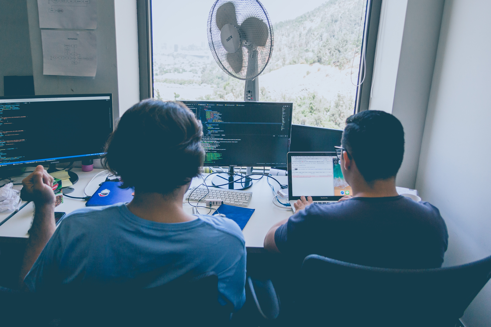

# Pair Programming

## Welcome! 👋
The purpose to create this repository to store all the information about my pair programming **projects**.

 **Pair programming**  is a software development technique in which two developers work together on the same task using a single workstation. The goal of pair programming is to improve code quality, productivity, and collaboration between team members.

## pair-programming-01
#### Project Name : **pair-programming-28**
- Time-Line : From **April 05 to April 11** (2023)
- programming partner : https://github.com/emerson-bualat
- Project repos : https://github.com/BlueDragn/pair-coding-28
- live link : Comming soon

